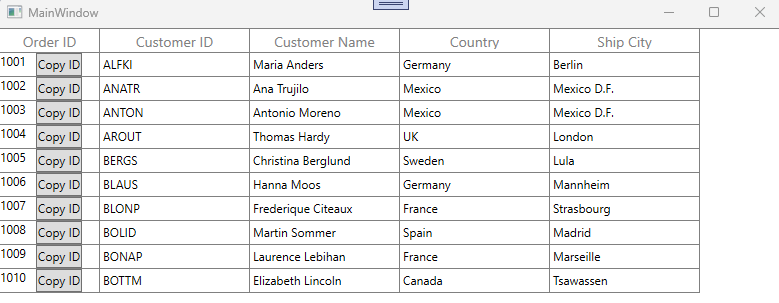

# How-to-add-columns-in-viewmodel-using-Prism-in-WPF-DataGrid

In [WPF DataGrid](https://www.syncfusion.com/wpf-controls/datagrid) (SfDataGrid), [columns](https://help.syncfusion.com/cr/wpf/Syncfusion.UI.Xaml.Grid.Columns.html) are typically defined in XAML or added in the code-behind by default. However, you can also add columns dynamically from the ViewModel when using Prism. Prism’s command support can be used to handle interactions within the MVVM pattern. To use Prism, you need to install the Prism.Core package.

**C#**
```
public class ViewModel : BindableBase
{
    // Backing fields
    private ObservableCollection<OrderInfo> _orders;
    private Columns sfGridColumns;

    // Command to copy
    public DelegateCommand<OrderInfo> CopyCommand { get; }

    // Property for Orders collection
    public ObservableCollection<OrderInfo> Orders
    {
        get { return _orders; }
        set { SetProperty(ref _orders, value); }
    }

    // Property for SfDataGrid columns
    public Columns SfGridColumns
    {
        get { return sfGridColumns; }
        set { SetProperty(ref sfGridColumns, value); }
    }

    public ViewModel()
    {
        // Initialize the command with the method to execute
        CopyCommand = new DelegateCommand<OrderInfo>(CopyAccountNo);

        // Set up the grid columns
        SetSfGridColumns();

        // Generate sample data
        _orders = new ObservableCollection<OrderInfo>();
        this.GenerateOrders();
    }

    /// <summary>
    /// Generates sample order data.
    /// </summary>
    private void GenerateOrders()
    {
        _orders.Add(new OrderInfo(1001, "Maria Anders", "Germany", "ALFKI", "Berlin"));
        _orders.Add(new OrderInfo(1002, "Ana Trujilo", "Mexico", "ANATR", "Mexico D.F."));
        _orders.Add(new OrderInfo(1003, "Antonio Moreno", "Mexico", "ANTON", "Mexico D.F."));
        _orders.Add(new OrderInfo(1004, "Thomas Hardy", "UK", "AROUT", "London"));
        _orders.Add(new OrderInfo(1005, "Christina Berglund", "Sweden", "BERGS", "Lula"));
        _orders.Add(new OrderInfo(1006, "Hanna Moos", "Germany", "BLAUS", "Mannheim"));
        _orders.Add(new OrderInfo(1007, "Frederique Citeaux", "France", "BLONP", "Strasbourg"));
        _orders.Add(new OrderInfo(1008, "Martin Sommer", "Spain", "BOLID", "Madrid"));
        _orders.Add(new OrderInfo(1009, "Laurence Lebihan", "France", "BONAP", "Marseille"));
        _orders.Add(new OrderInfo(1010, "Elizabeth Lincoln", "Canada", "BOTTM", "Tsawassen"));
    }

    /// <summary>
    /// Sets up the columns for the SfDataGrid.
    /// </summary>
    private void SetSfGridColumns()
    {
        string cellTemplateXaml =
            @"<DataTemplate xmlns='http://schemas.microsoft.com/winfx/2006/xaml/presentation'
                        xmlns:x='http://schemas.microsoft.com/winfx/2006/xaml'
                        xmlns:syncfusion='http://schemas.syncfusion.com/wpf'>
            <StackPanel Orientation='Horizontal'>
                <TextBlock Text='{Binding OrderID}' Margin='0,0,10,0'/>
                <Button Content='Copy ID'
                        Command='{Binding DataContext.CopyCommand,ElementName=sfGrid}'
                        CommandParameter='{Binding}'/>
            </StackPanel>
        </DataTemplate>";

        var template = (DataTemplate)XamlReader.Parse(cellTemplateXaml);

        var cols = new Columns();

        cols.Add(new GridTemplateColumn
        {
            MappingName = "OrderID",
            HeaderText = "Order ID",
            CellTemplate = template,
            Width = 100
        });

        cols.Add(new GridTextColumn
        {
            MappingName = "CustomerID",
            HeaderText = "Customer ID"
        });

        cols.Add(new GridTextColumn
        {
            MappingName = "CustomerName",
            HeaderText = "Customer Name"
        });

        cols.Add(new GridTextColumn
        {
            MappingName = "Country",
            HeaderText = "Country"
        });

        cols.Add(new GridTextColumn
        {
            MappingName = "ShipCity",
            HeaderText = "Ship City"
        });

        sfGridColumns = cols;
    }

    /// <summary>
    /// Copies the OrderID of the given order to the clipboard.
    /// </summary>
    /// <param name="orderID"></param>
    private void CopyAccountNo(OrderInfo orderID)
    {
        if (orderID == null || orderID.OrderID == null)
            return;
        var text = orderID.OrderID.ToString();
        Clipboard.SetText(text);
    }
}
```



Take a moment to peruse the [WPF DataGrid - Columns](https://help.syncfusion.com/wpf/datagrid/columns) documentation, to learn more about columns with examples.